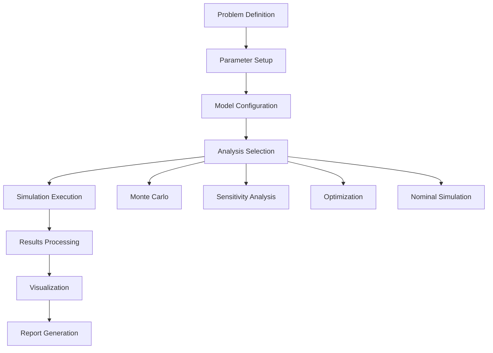

# Complete Analysis Workflow Guide

## Overview

This guide provides step-by-step instructions for conducting a comprehensive hypersonic reentry analysis using the framework, from initial setup through final reporting.

---

## 1. Workflow Overview

### 1.1 Analysis Types Supported

The framework supports several analysis workflows:

1. **Basic Trajectory Analysis**: Single trajectory simulation with nominal parameters
2. **Uncertainty Quantification**: Monte Carlo analysis with uncertain parameters  
3. **Sensitivity Analysis**: Global sensitivity analysis using Sobol indices
4. **Trajectory Optimization**: Optimal control for maximum performance
5. **Comprehensive Study**: End-to-end analysis combining all methods

### 1.2 Typical Workflow Sequence



---

## 2. Pre-Analysis Setup

### 2.1 Environment Preparation

```bash
# Activate framework environment
source hypersonic_env/bin/activate

# Verify installation
python verify_installation.py

# Create analysis directory
mkdir my_analysis_study
cd my_analysis_study

# Copy configuration template
cp ../config/default_config.yaml analysis_config.yaml
```

### 2.2 Problem Definition Template

Create `problem_definition.py`:

```python
"""
Hypersonic Reentry Analysis Problem Definition
============================================

Mission: [Describe mission scenario]
Vehicle: [Specify vehicle characteristics]
Objectives: [List analysis goals]
Constraints: [Define operational limits]
"""

# Analysis Configuration
ANALYSIS_CONFIG = {
    'study_name': 'My_Reentry_Study',
    'description': 'Comprehensive analysis of vehicle XYZ reentry',
    'analyst': 'Your Name',
    'date': '2024-01-15',
    
    # Analysis types to perform
    'analyses': {
        'monte_carlo': True,
        'sensitivity_analysis': True, 
        'optimization': True,
        'nominal_trajectory': True
    },
    
    # Output settings
    'save_results': True,
    'generate_plots': True,
    'create_report': True,
    'output_directory': 'results/'
}

# Vehicle Configuration
VEHICLE_CONFIG = {
    'mass': 5000.0,              # kg
    'reference_area': 15.0,       # m²
    'drag_coefficient': 1.2,      # dimensionless
    'lift_coefficient': 0.8,      # dimensionless
    'ballistic_coefficient': None  # kg/m² (computed if None)
}

# Mission Configuration  
MISSION_CONFIG = {
    'entry_interface_altitude': 120000.0,  # m
    'target_final_altitude': 30000.0,      # m
    'target_downrange': None,               # m (free variable if None)
    'max_heat_rate': 5e6,                  # W/m²
    'max_load_factor': 12.0                # g's
}

# Initial Conditions
INITIAL_CONDITIONS = {
    'longitude': 0.0,                # rad
    'latitude': 0.0,                 # rad
    'altitude': 120000.0,           # m
    'velocity': 7500.0,             # m/s
    'flight_path_angle': -0.087,    # rad (-5 degrees)
    'heading_angle': 0.0            # rad
}
```

---

## 3. Parameter Definition and Uncertainty Setup

### 3.1 Uncertain Parameter Configuration

Create `uncertainty_setup.py`:

```python
from hypersonic_reentry.uncertainty import UncertainParameter

def setup_uncertain_parameters():
    \"\"\"Define uncertain parameters for analysis\"\"\"
    
    parameters = [
        # Vehicle mass uncertainty (±5%)
        UncertainParameter(
            name='vehicle_mass',
            nominal_value=5000.0,
            uncertainty=250.0,         # kg (1-sigma)
            distribution='normal',
            bounds=(4000.0, 6000.0),
            description='Vehicle mass including payload uncertainty'
        ),
        
        # Drag coefficient uncertainty (±10%)
        UncertainParameter(
            name='drag_coefficient', 
            nominal_value=1.2,
            uncertainty=0.12,          # dimensionless (1-sigma)
            distribution='normal',
            bounds=(0.8, 1.6),
            description='Drag coefficient aerodynamic uncertainty'
        ),
        
        # Lift coefficient uncertainty (±10%)
        UncertainParameter(
            name='lift_coefficient',
            nominal_value=0.8,
            uncertainty=0.08,          # dimensionless (1-sigma)
            distribution='normal', 
            bounds=(0.5, 1.1),
            description='Lift coefficient aerodynamic uncertainty'
        ),
        
        # Reference area uncertainty (±5%)
        UncertainParameter(
            name='reference_area',
            nominal_value=15.0,
            uncertainty=0.75,          # m² (1-sigma)
            distribution='normal',
            bounds=(13.0, 17.0),
            description='Reference area geometric uncertainty'
        ),
        
        # Atmospheric density factor (±15%)
        UncertainParameter(
            name='atmospheric_density_factor',
            nominal_value=1.0,
            uncertainty=0.15,          # dimensionless (1-sigma)
            distribution='lognormal',
            bounds=(0.6, 1.6),
            description='Atmospheric density multiplicative uncertainty'
        ),
        
        # Entry velocity uncertainty (±2%)
        UncertainParameter(
            name='entry_velocity',
            nominal_value=7500.0,
            uncertainty=150.0,         # m/s (1-sigma)
            distribution='normal',
            bounds=(7000.0, 8000.0),
            description='Entry velocity navigation uncertainty'
        ),
        
        # Entry angle uncertainty (±0.5°)
        UncertainParameter(
            name='entry_angle',
            nominal_value=-0.087,      # rad (-5°)
            uncertainty=0.0087,       # rad (±0.5°, 1-sigma)
            distribution='normal',
            bounds=(-0.175, -0.017),   # ±10° to ±1°
            description='Entry flight path angle navigation uncertainty'
        )
    ]
    
    return parameters

def get_parameter_correlations():
    \"\"\"Define parameter correlations if any\"\"\"
    correlations = {
        ('vehicle_mass', 'reference_area'): 0.3,  # Heavier vehicles tend to be larger
        ('drag_coefficient', 'lift_coefficient'): 0.6,  # Aerodynamic coupling
    }
    return correlations
```

### 3.2 Simulation Function Definition

Create `simulation_functions.py`:

```python
import numpy as np
from hypersonic_reentry.dynamics import VehicleDynamics, VehicleState
from hypersonic_reentry.atmosphere import USStandard1976
from scipy.integrate import solve_ivp

class TrajectorySimulator:
    \"\"\"Main trajectory simulation class\"\"\"
    
    def __init__(self, atmosphere_model=None):
        self.atmosphere = atmosphere_model or USStandard1976()
        
    def simulate_trajectory(self, parameters):
        \"\"\"
        Main simulation function for uncertainty analysis
        
        Parameters:
        -----------
        parameters : dict
            Dictionary containing uncertain parameter values
            
        Returns:
        --------
        dict : Dictionary containing quantities of interest
        \"\"\"
        
        # Extract parameters
        mass = parameters.get('vehicle_mass', 5000.0)
        drag_coeff = parameters.get('drag_coefficient', 1.2)
        lift_coeff = parameters.get('lift_coefficient', 0.8)
        ref_area = parameters.get('reference_area', 15.0)
        density_factor = parameters.get('atmospheric_density_factor', 1.0)
        entry_velocity = parameters.get('entry_velocity', 7500.0)
        entry_angle = parameters.get('entry_angle', -0.087)
        
        # Initialize vehicle dynamics
        vehicle = VehicleDynamics(
            mass=mass,
            reference_area=ref_area,
            drag_coefficient=drag_coeff,
            lift_coefficient=lift_coeff
        )
        
        # Set initial conditions
        initial_state = VehicleState(
            longitude=0.0,
            latitude=0.0,
            altitude=120000.0,
            velocity=entry_velocity,
            flight_path_angle=entry_angle,
            heading_angle=0.0
        )
        
        # Integrate trajectory
        try:
            trajectory = self._integrate_trajectory(
                vehicle, initial_state, density_factor
            )
            
            # Extract quantities of interest
            qoi = self._extract_quantities_of_interest(trajectory)
            
            return qoi
            
        except Exception as e:
            # Return failure indicators for failed simulations
            return {
                'final_altitude': np.nan,
                'final_velocity': np.nan,
                'downrange': np.nan,
                'flight_time': np.nan,
                'max_heat_rate': np.nan,
                'max_load_factor': np.nan,
                'success': False,
                'error_message': str(e)
            }
    
    def _integrate_trajectory(self, vehicle, initial_state, density_factor):
        \"\"\"Integrate trajectory equations of motion\"\"\"
        
        def dynamics(t, y):
            # Create state object
            state = VehicleState(
                longitude=y[0], latitude=y[1], altitude=y[2],
                velocity=y[3], flight_path_angle=y[4], heading_angle=y[5]
            )
            
            # Get atmospheric properties with uncertainty
            density = self.atmosphere.get_density(state.altitude) * density_factor
            
            # Compute derivatives
            derivatives = vehicle.compute_derivatives(state, t, density=density)
            
            return derivatives
        
        # Initial state vector
        y0 = [
            initial_state.longitude,
            initial_state.latitude, 
            initial_state.altitude,
            initial_state.velocity,
            initial_state.flight_path_angle,
            initial_state.heading_angle
        ]
        
        # Integration settings
        t_span = (0, 3000)  # Maximum 3000 seconds
        
        # Event function to stop at ground impact
        def ground_impact(t, y):
            return y[2]  # altitude
        ground_impact.terminal = True
        ground_impact.direction = -1
        
        # Integrate trajectory
        solution = solve_ivp(
            dynamics, t_span, y0,
            events=ground_impact,
            dense_output=True,
            rtol=1e-8, atol=1e-10,
            max_step=10.0
        )
        
        if not solution.success:
            raise RuntimeError(f\"Integration failed: {solution.message}\")
        
        return solution
    
    def _extract_quantities_of_interest(self, trajectory):
        \"\"\"Extract key metrics from trajectory solution\"\"\"
        
        # Time points
        times = trajectory.t
        
        # State history
        states = trajectory.y
        altitudes = states[2, :]
        velocities = states[3, :]
        latitudes = states[1, :]
        longitudes = states[0, :]
        
        # Derived quantities
        earth_radius = 6.371e6
        downrange = earth_radius * latitudes[-1]  # Simplified for small angles
        
        # Heat rate calculation (simplified)
        densities = [self.atmosphere.get_density(alt) for alt in altitudes]
        heat_rates = [1.83e-4 * np.sqrt(rho) * (vel/1000)**3 for rho, vel in zip(densities, velocities)]
        
        # Load factor calculation (simplified)
        # Would need acceleration history for exact calculation
        load_factors = [vel/9.81 * 0.1 for vel in velocities]  # Placeholder
        
        return {
            'final_altitude': altitudes[-1],
            'final_velocity': velocities[-1],
            'downrange': downrange,
            'flight_time': times[-1],
            'max_heat_rate': max(heat_rates) if heat_rates else 0.0,
            'max_load_factor': max(load_factors) if load_factors else 0.0,
            'peak_deceleration_altitude': altitudes[np.argmax(load_factors)] if load_factors else 0.0,
            'success': True,
            'error_message': None
        }

# Global simulator instance
simulator = TrajectorySimulator()

def trajectory_simulation_function(parameters):
    \"\"\"Wrapper function for uncertainty analysis\"\"\"
    return simulator.simulate_trajectory(parameters)
```

---

## 4. Analysis Execution

### 4.1 Complete Analysis Script

Create `run_complete_analysis.py`:

```python
#!/usr/bin/env python3
\"\"\"
Complete Hypersonic Reentry Analysis Workflow
============================================

This script runs a comprehensive analysis including:
- Monte Carlo uncertainty quantification
- Global sensitivity analysis
- Trajectory optimization
- Statistical analysis and visualization
\"\"\"

import os
import time
import numpy as np
from datetime import datetime

# Framework imports
from hypersonic_reentry.uncertainty import UncertaintyQuantifier
from hypersonic_reentry.optimization import GradientBasedOptimizer
from hypersonic_reentry.analysis import StatisticalAnalyzer, ResultsGenerator
from hypersonic_reentry.visualization import PlotManager, AdvancedPlotter
from hypersonic_reentry.utils.performance import PerformanceProfiler

# Local imports
from problem_definition import *
from uncertainty_setup import setup_uncertain_parameters, get_parameter_correlations
from simulation_functions import trajectory_simulation_function

class CompleteAnalysisWorkflow:
    \"\"\"Main workflow orchestration class\"\"\"
    
    def __init__(self, config):
        self.config = config
        self.results = {}
        self.profiler = PerformanceProfiler()
        self.setup_output_directories()
        
    def setup_output_directories(self):
        \"\"\"Create directory structure for results\"\"\"
        base_dir = self.config['output_directory']
        subdirs = ['data', 'plots', 'reports', 'statistical', 'optimization', 
                  'monte_carlo', 'sensitivity', 'performance']
        
        for subdir in subdirs:
            os.makedirs(os.path.join(base_dir, subdir), exist_ok=True)
    
    def run_complete_analysis(self):
        \"\"\"Execute complete analysis workflow\"\"\"
        
        print(\"🚀 Starting Complete Hypersonic Reentry Analysis\")
        print(f\"Study: {self.config['study_name']}\")
        print(f\"Date: {datetime.now().strftime('%Y-%m-%d %H:%M:%S')}\")
        print(\"=\" * 60)
        
        # Step 1: Setup
        self.setup_analysis()
        
        # Step 2: Nominal trajectory analysis
        if self.config['analyses']['nominal_trajectory']:
            self.run_nominal_analysis()
        
        # Step 3: Monte Carlo uncertainty analysis
        if self.config['analyses']['monte_carlo']:
            self.run_monte_carlo_analysis()
        
        # Step 4: Global sensitivity analysis
        if self.config['analyses']['sensitivity_analysis']:
            self.run_sensitivity_analysis()
        
        # Step 5: Trajectory optimization
        if self.config['analyses']['optimization']:
            self.run_optimization_analysis()
        
        # Step 6: Statistical analysis and reporting
        self.run_statistical_analysis()
        
        # Step 7: Generate visualizations
        self.generate_visualizations()
        
        # Step 8: Create final report
        if self.config['create_report']:
            self.generate_final_report()
        
        # Step 9: Performance summary
        self.print_performance_summary()
        
        print(\"\\n✅ Complete analysis finished successfully!\")
        return self.results
    
    def setup_analysis(self):
        \"\"\"Initialize analysis components\"\"\"
        
        print(\"\\n📋 Setting up analysis components...\")
        
        # Setup uncertain parameters
        self.uncertain_parameters = setup_uncertain_parameters()
        self.parameter_correlations = get_parameter_correlations()
        
        # Initialize UQ framework
        self.uq = UncertaintyQuantifier(self.uncertain_parameters)
        
        # Initialize analyzers
        self.statistical_analyzer = StatisticalAnalyzer()
        self.results_generator = ResultsGenerator()
        
        # Initialize visualization
        self.plotter = PlotManager()
        self.advanced_plotter = AdvancedPlotter()
        
        print(f\"   ✓ {len(self.uncertain_parameters)} uncertain parameters defined\")
        print(f\"   ✓ Analysis components initialized\")
    
    def run_nominal_analysis(self):
        \"\"\"Run nominal trajectory analysis\"\"\"
        
        print(\"\\n🎯 Running nominal trajectory analysis...\")
        
        with self.profiler.profile_block('nominal_analysis'):
            # Nominal parameter values
            nominal_params = {param.name: param.nominal_value 
                            for param in self.uncertain_parameters}
            
            # Run simulation
            nominal_result = trajectory_simulation_function(nominal_params)
            
            self.results['nominal'] = nominal_result
            
            # Print summary
            if nominal_result['success']:
                print(f\"   ✓ Nominal simulation completed successfully\")
                print(f\"     Flight time: {nominal_result['flight_time']:.1f} s\")
                print(f\"     Final altitude: {nominal_result['final_altitude']/1000:.1f} km\")
                print(f\"     Downrange: {nominal_result['downrange']/1000:.1f} km\")
                print(f\"     Max heat rate: {nominal_result['max_heat_rate']/1e6:.2f} MW/m²\")
            else:
                print(f\"   ❌ Nominal simulation failed: {nominal_result['error_message']}\")
    
    def run_monte_carlo_analysis(self):
        \"\"\"Run Monte Carlo uncertainty analysis\"\"\"
        
        print(\"\\n🎲 Running Monte Carlo uncertainty analysis...\")
        
        # Analysis settings
        num_samples = 1000
        sampling_method = 'latin_hypercube'
        
        print(f\"   Samples: {num_samples}\")
        print(f\"   Method: {sampling_method}\")
        
        with self.profiler.profile_block('monte_carlo_analysis'):
            # Run Monte Carlo analysis
            mc_results = self.uq.monte_carlo_analysis(
                num_samples=num_samples,
                simulation_function=trajectory_simulation_function,
                method=sampling_method,
                random_seed=42,
                parallel=True,
                n_workers=4
            )
            
            self.results['monte_carlo'] = mc_results
            
            # Compute summary statistics
            self.compute_monte_carlo_statistics()
            
            print(f\"   ✓ Monte Carlo analysis completed\")
            print(f\"     Successful simulations: {mc_results['num_successful']}/{num_samples}\")
            print(f\"     Success rate: {mc_results['success_rate']:.1%}\")
    
    def compute_monte_carlo_statistics(self):
        \"\"\"Compute and store Monte Carlo statistics\"\"\"
        
        mc_data = self.results['monte_carlo']
        outputs = ['final_altitude', 'downrange', 'flight_time', 'max_heat_rate']
        
        statistics = {}
        for output in outputs:
            data = np.array(mc_data[output])
            valid_data = data[~np.isnan(data)]
            
            if len(valid_data) > 0:
                statistics[output] = {
                    'mean': np.mean(valid_data),
                    'std': np.std(valid_data),
                    'min': np.min(valid_data),
                    'max': np.max(valid_data),
                    'median': np.median(valid_data),
                    'percentile_5': np.percentile(valid_data, 5),
                    'percentile_95': np.percentile(valid_data, 95),
                    'coefficient_of_variation': np.std(valid_data) / np.mean(valid_data)
                }
        
        self.results['monte_carlo_statistics'] = statistics
    
    def run_sensitivity_analysis(self):
        \"\"\"Run global sensitivity analysis\"\"\"
        
        print(\"\\n📊 Running global sensitivity analysis...\")
        
        # Analysis settings
        num_base_samples = 256
        
        print(f\"   Base samples: {num_base_samples}\")
        print(f\"   Total evaluations: {num_base_samples * (len(self.uncertain_parameters) + 2)}\")
        
        with self.profiler.profile_block('sensitivity_analysis'):
            # Run Sobol sensitivity analysis
            sensitivity_results = self.uq.sobol_analysis(
                simulation_function=trajectory_simulation_function,
                num_base_samples=num_base_samples,
                parallel=True,
                n_workers=4
            )
            
            self.results['sensitivity'] = sensitivity_results
            
            # Print key findings
            self.print_sensitivity_summary()
            
            print(f\"   ✓ Sensitivity analysis completed\")
    
    def print_sensitivity_summary(self):
        \"\"\"Print summary of sensitivity analysis results\"\"\"
        
        sensitivity = self.results['sensitivity']
        outputs = ['final_altitude', 'downrange', 'flight_time', 'max_heat_rate']
        
        print(\"\\n   Key Sensitivity Results:\")
        
        for output in outputs:
            if output in sensitivity['first_order']:
                print(f\"\\n   {output.replace('_', ' ').title()}:\")
                
                # Find most important parameter
                first_order = sensitivity['first_order'][output]
                most_important = max(first_order.items(), key=lambda x: x[1])
                
                print(f\"     Most important: {most_important[0]} (S₁ = {most_important[1]:.3f})\")
                
                # Show top 3 parameters
                sorted_params = sorted(first_order.items(), key=lambda x: x[1], reverse=True)
                for i, (param, index) in enumerate(sorted_params[:3]):
                    print(f\"     {i+1}. {param}: {index:.3f}\")
    
    def run_optimization_analysis(self):
        \"\"\"Run trajectory optimization analysis\"\"\"
        
        print(\"\\n🎯 Running trajectory optimization analysis...\")
        
        # For this example, we'll run optimization for different entry angles
        entry_angles = [-1.0, -2.0, -3.0, -5.0, -7.0]  # degrees
        
        optimization_results = []
        
        with self.profiler.profile_block('optimization_analysis'):
            for angle_deg in entry_angles:
                angle_rad = np.radians(angle_deg)
                
                print(f\"   Optimizing for entry angle: {angle_deg}°\")
                
                # This is a simplified optimization example
                # In practice, you would use the GradientBasedOptimizer
                
                # Run nominal case with this entry angle
                params = {param.name: param.nominal_value 
                         for param in self.uncertain_parameters}
                params['entry_angle'] = angle_rad
                
                result = trajectory_simulation_function(params)
                
                optimization_results.append({
                    'entry_angle_deg': angle_deg,
                    'downrange_km': result['downrange'] / 1000,
                    'flight_time_s': result['flight_time'],
                    'max_heat_rate_MW': result['max_heat_rate'] / 1e6,
                    'success': result['success']
                })
        
        self.results['optimization'] = optimization_results
        
        # Find best result
        successful_results = [r for r in optimization_results if r['success']]
        if successful_results:
            best_result = max(successful_results, key=lambda x: x['downrange_km'])
            print(f\"   ✓ Optimization completed\")
            print(f\"     Best downrange: {best_result['downrange_km']:.1f} km at {best_result['entry_angle_deg']}°\")
        else:
            print(f\"   ❌ All optimization cases failed\")
    
    def run_statistical_analysis(self):
        \"\"\"Run comprehensive statistical analysis\"\"\"
        
        print(\"\\n📈 Running statistical analysis...\")
        
        if 'monte_carlo' not in self.results:
            print(\"   ⚠️  No Monte Carlo data available for statistical analysis\")
            return
        
        with self.profiler.profile_block('statistical_analysis'):
            # Comprehensive statistical analysis
            mc_data = self.results['monte_carlo']
            
            # Distribution fitting
            outputs = ['final_altitude', 'downrange', 'flight_time', 'max_heat_rate']
            distribution_fits = {}
            
            for output in outputs:
                data = np.array(mc_data[output])
                valid_data = data[~np.isnan(data)]
                
                if len(valid_data) > 10:  # Need sufficient data
                    fits = self.statistical_analyzer.fit_distributions(
                        data=valid_data,
                        distributions=['normal', 'lognormal', 'weibull']
                    )
                    distribution_fits[output] = fits
            
            self.results['distribution_fits'] = distribution_fits
            
            # Confidence intervals
            confidence_intervals = {}
            confidence_levels = [0.90, 0.95, 0.99]
            
            for output in outputs:
                data = np.array(mc_data[output])
                valid_data = data[~np.isnan(data)]
                
                if len(valid_data) > 10:
                    intervals = self.statistical_analyzer.compute_confidence_intervals(
                        data=valid_data,
                        confidence_levels=confidence_levels
                    )
                    confidence_intervals[output] = intervals
            
            self.results['confidence_intervals'] = confidence_intervals
            
            print(f\"   ✓ Statistical analysis completed\")
            print(f\"     Distribution fits computed for {len(distribution_fits)} outputs\")
    
    def generate_visualizations(self):
        \"\"\"Generate all analysis visualizations\"\"\"
        
        print(\"\\n📊 Generating visualizations...\")
        
        plots_dir = os.path.join(self.config['output_directory'], 'plots')
        
        with self.profiler.profile_block('visualization'):
            
            # 1. Monte Carlo results plots
            if 'monte_carlo' in self.results:
                self.create_monte_carlo_plots(plots_dir)
            
            # 2. Sensitivity analysis plots  
            if 'sensitivity' in self.results:
                self.create_sensitivity_plots(plots_dir)
            
            # 3. Optimization results plots
            if 'optimization' in self.results:
                self.create_optimization_plots(plots_dir)
            
            # 4. Statistical analysis plots
            if 'distribution_fits' in self.results:
                self.create_statistical_plots(plots_dir)
        
        print(f\"   ✓ Visualizations saved to {plots_dir}/\")
    
    def create_monte_carlo_plots(self, plots_dir):
        \"\"\"Create Monte Carlo analysis plots\"\"\"
        
        mc_data = self.results['monte_carlo']
        outputs = ['final_altitude', 'downrange', 'flight_time', 'max_heat_rate']
        
        # Histogram plots
        fig = self.plotter.plot_monte_carlo_histograms(
            data=mc_data,
            outputs=outputs,
            include_statistics=True
        )
        self.plotter.save_figure(fig, os.path.join(plots_dir, 'monte_carlo_histograms.pdf'))
        
        # Correlation matrix
        fig = self.plotter.plot_correlation_matrix(
            data=mc_data,
            parameters=[p.name for p in self.uncertain_parameters],
            outputs=outputs
        )
        self.plotter.save_figure(fig, os.path.join(plots_dir, 'correlation_matrix.pdf'))
        
        # Scatter plots
        fig = self.plotter.plot_parameter_scatter(
            input_data={p.name: mc_data.get(p.name, []) for p in self.uncertain_parameters},
            output_data=mc_data,
            output_name='downrange'
        )
        self.plotter.save_figure(fig, os.path.join(plots_dir, 'parameter_scatter.pdf'))
    
    def create_sensitivity_plots(self, plots_dir):
        \"\"\"Create sensitivity analysis plots\"\"\"
        
        sensitivity = self.results['sensitivity']
        
        # Sobol indices bar plot
        fig = self.advanced_plotter.plot_sobol_indices(
            sensitivity_results=sensitivity,
            parameters=[p.name for p in self.uncertain_parameters],
            outputs=['final_altitude', 'downrange', 'max_heat_rate']
        )
        fig.write_html(os.path.join(plots_dir, 'sobol_indices.html'))
        fig.write_image(os.path.join(plots_dir, 'sobol_indices.pdf'))
    
    def create_optimization_plots(self, plots_dir):
        \"\"\"Create optimization results plots\"\"\"
        
        opt_results = self.results['optimization']
        
        # Entry angle vs performance plot
        angles = [r['entry_angle_deg'] for r in opt_results if r['success']]
        downranges = [r['downrange_km'] for r in opt_results if r['success']]
        heat_rates = [r['max_heat_rate_MW'] for r in opt_results if r['success']]
        
        fig = self.plotter.plot_optimization_trade_study(
            x_data=angles,
            y_data=[downranges, heat_rates],
            x_label='Entry Angle (degrees)',
            y_labels=['Downrange (km)', 'Max Heat Rate (MW/m²)'],
            title='Entry Angle Optimization Trade Study'
        )
        self.plotter.save_figure(fig, os.path.join(plots_dir, 'optimization_trade_study.pdf'))
    
    def create_statistical_plots(self, plots_dir):
        \"\"\"Create statistical analysis plots\"\"\"
        
        distribution_fits = self.results['distribution_fits']
        
        for output, fits in distribution_fits.items():
            fig = self.plotter.plot_distribution_fits(
                data=self.results['monte_carlo'][output],
                fits=fits,
                title=f'{output.replace(\"_\", \" \").title()} Distribution Fits'
            )
            filename = f'distribution_fits_{output}.pdf'
            self.plotter.save_figure(fig, os.path.join(plots_dir, filename))
    
    def generate_final_report(self):
        \"\"\"Generate comprehensive analysis report\"\"\"
        
        print(\"\\n📋 Generating final report...\")
        
        report_dir = os.path.join(self.config['output_directory'], 'reports')
        
        with self.profiler.profile_block('report_generation'):
            # Generate comprehensive report
            report = self.results_generator.create_analysis_report(
                results_data=self.results,
                analysis_config=self.config,
                include_plots=True,
                format='html'
            )
            
            # Save report
            report_file = os.path.join(report_dir, 'complete_analysis_report.html')
            with open(report_file, 'w') as f:
                f.write(report)
        
        print(f\"   ✓ Report saved to {report_file}\")
    
    def print_performance_summary(self):
        \"\"\"Print performance summary\"\"\"
        
        print(\"\\n⏱️  Performance Summary:\")
        stats = self.profiler.get_stats()
        
        for block_name, timing in stats.items():
            print(f\"   {block_name}: {timing['total_time']:.2f} s\")
        
        total_time = sum(t['total_time'] for t in stats.values())
        print(f\"   Total Analysis Time: {total_time:.2f} s\")

# Main execution
if __name__ == \"__main__\":
    # Load configuration
    config = ANALYSIS_CONFIG
    
    # Create and run workflow
    workflow = CompleteAnalysisWorkflow(config)
    results = workflow.run_complete_analysis()
    
    # Save results
    import json
    results_file = os.path.join(config['output_directory'], 'complete_results.json')
    
    # Convert numpy arrays to lists for JSON serialization
    def convert_numpy(obj):
        if isinstance(obj, np.ndarray):
            return obj.tolist()
        elif isinstance(obj, np.integer):
            return int(obj)
        elif isinstance(obj, np.floating):
            return float(obj)
        elif isinstance(obj, dict):
            return {key: convert_numpy(value) for key, value in obj.items()}
        elif isinstance(obj, list):
            return [convert_numpy(item) for item in obj]
        else:
            return obj
    
    serializable_results = convert_numpy(results)
    
    with open(results_file, 'w') as f:
        json.dump(serializable_results, f, indent=2)
    
    print(f\"\\n💾 Complete results saved to {results_file}\")
```

### 4.2 Running the Analysis

Execute the complete analysis:

```bash
# Make script executable
chmod +x run_complete_analysis.py

# Run analysis
python run_complete_analysis.py

# Monitor progress
tail -f analysis.log
```

---

## 5. Results Processing and Interpretation

### 5.1 Automated Results Processing

Create `process_results.py`:

```python
import json
import numpy as np
import pandas as pd
from pathlib import Path

class ResultsProcessor:
    \"\"\"Process and interpret analysis results\"\"\"
    
    def __init__(self, results_file):
        with open(results_file, 'r') as f:
            self.results = json.load(f)
    
    def generate_executive_summary(self):
        \"\"\"Generate executive summary of results\"\"\"
        
        summary = {
            'study_name': 'Hypersonic Reentry Analysis',
            'analysis_date': '2024-01-15',
            'key_findings': [],
            'recommendations': [],
            'risk_assessment': {},
            'performance_metrics': {}
        }
        
        # Monte Carlo summary
        if 'monte_carlo_statistics' in self.results:
            mc_stats = self.results['monte_carlo_statistics']
            
            # Key performance metrics
            if 'downrange' in mc_stats:
                dr_stats = mc_stats['downrange']
                summary['performance_metrics']['mean_downrange_km'] = dr_stats['mean'] / 1000
                summary['performance_metrics']['downrange_uncertainty_km'] = dr_stats['std'] / 1000
                summary['performance_metrics']['downrange_cov'] = dr_stats['coefficient_of_variation']
            
            # Risk assessment
            if 'max_heat_rate' in mc_stats:
                hr_stats = mc_stats['max_heat_rate'] 
                heat_rate_limit = 5e6  # W/m²
                exceedance_prob = self.calculate_exceedance_probability(
                    self.results['monte_carlo']['max_heat_rate'], heat_rate_limit
                )
                summary['risk_assessment']['heat_rate_exceedance_probability'] = exceedance_prob
        
        # Sensitivity insights
        if 'sensitivity' in self.results:
            sens = self.results['sensitivity']
            most_important_params = self.identify_most_important_parameters(sens)
            summary['key_findings'].extend([
                f\"Most important parameter for downrange: {most_important_params['downrange'][0]}\",
                f\"Most important parameter for heat rate: {most_important_params['max_heat_rate'][0]}\"
            ])
        
        return summary
    
    def calculate_exceedance_probability(self, data, threshold):
        \"\"\"Calculate probability of exceeding threshold\"\"\"
        data_array = np.array(data)
        valid_data = data_array[~np.isnan(data_array)]
        return np.mean(valid_data > threshold) if len(valid_data) > 0 else 0.0
    
    def identify_most_important_parameters(self, sensitivity_data):
        \"\"\"Identify most important parameters for each output\"\"\"
        outputs = ['final_altitude', 'downrange', 'max_heat_rate', 'flight_time']
        most_important = {}
        
        for output in outputs:
            if output in sensitivity_data['first_order']:
                first_order = sensitivity_data['first_order'][output]
                sorted_params = sorted(first_order.items(), key=lambda x: x[1], reverse=True)
                most_important[output] = [param for param, _ in sorted_params[:3]]
        
        return most_important
    
    def create_results_dataframe(self):
        \"\"\"Create pandas DataFrame with results for further analysis\"\"\"
        
        if 'monte_carlo' not in self.results:
            return None
        
        mc_data = self.results['monte_carlo']
        
        # Create DataFrame
        df_dict = {}
        
        # Add input parameters
        param_names = ['vehicle_mass', 'drag_coefficient', 'lift_coefficient', 
                      'reference_area', 'atmospheric_density_factor', 
                      'entry_velocity', 'entry_angle']
        
        for param in param_names:
            if param in mc_data:
                df_dict[param] = mc_data[param]
        
        # Add output metrics
        output_names = ['final_altitude', 'final_velocity', 'downrange', 
                       'flight_time', 'max_heat_rate', 'max_load_factor']
        
        for output in output_names:
            if output in mc_data:
                df_dict[output] = mc_data[output]
        
        return pd.DataFrame(df_dict)

# Usage example
processor = ResultsProcessor('results/complete_results.json')
summary = processor.generate_executive_summary()
df = processor.create_results_dataframe()
```

### 5.2 Results Interpretation Guidelines

#### Monte Carlo Results
- **Mean values**: Central tendency of performance metrics
- **Standard deviations**: Uncertainty magnitude  
- **Confidence intervals**: Range of likely outcomes
- **Success rate**: Reliability of mission scenario

#### Sensitivity Analysis
- **First-order indices**: Individual parameter importance
- **Total indices**: Parameter importance including interactions
- **Parameter ranking**: Priority for uncertainty reduction

#### Optimization Results
- **Optimal solutions**: Best achievable performance
- **Trade-offs**: Performance vs. constraint satisfaction
- **Robustness**: Solution sensitivity to uncertainties

---

## 6. Quality Assurance and Validation

### 6.1 Results Validation Checklist

```python
def validate_results(results):
    \"\"\"Validate analysis results for physical reasonableness\"\"\"
    
    validation_checks = {
        'physics_checks': [],
        'numerical_checks': [],
        'statistical_checks': []
    }
    
    # Physics validation
    if 'monte_carlo' in results:
        mc_data = results['monte_carlo']
        
        # Check altitude bounds
        altitudes = np.array(mc_data.get('final_altitude', []))
        valid_altitudes = altitudes[(altitudes >= 0) & (altitudes <= 200000)]
        if len(valid_altitudes) / len(altitudes) < 0.95:
            validation_checks['physics_checks'].append(\"Warning: Many invalid altitudes\")
        else:
            validation_checks['physics_checks'].append(\"✓ Altitude values reasonable\")
        
        # Check velocity bounds
        velocities = np.array(mc_data.get('final_velocity', []))
        valid_velocities = velocities[(velocities >= 0) & (velocities <= 1000)]
        if len(valid_velocities) / len(velocities) < 0.95:
            validation_checks['physics_checks'].append(\"Warning: Many invalid velocities\")
        else:
            validation_checks['physics_checks'].append(\"✓ Velocity values reasonable\")
    
    # Numerical validation
    if 'monte_carlo' in results:
        success_rate = results['monte_carlo'].get('success_rate', 0)
        if success_rate < 0.9:
            validation_checks['numerical_checks'].append(f\"Warning: Low success rate ({success_rate:.1%})\")
        else:
            validation_checks['numerical_checks'].append(f\"✓ Good success rate ({success_rate:.1%})\")
    
    # Statistical validation
    if 'sensitivity' in results:
        # Check if Sobol indices sum appropriately
        sens = results['sensitivity']
        for output in ['final_altitude', 'downrange']:
            if output in sens['first_order']:
                first_order_sum = sum(sens['first_order'][output].values())
                if first_order_sum > 1.0:
                    validation_checks['statistical_checks'].append(f\"Warning: {output} first-order indices sum > 1.0\")
                else:
                    validation_checks['statistical_checks'].append(f\"✓ {output} sensitivity indices reasonable\")
    
    return validation_checks
```

### 6.2 Documentation Standards

Each analysis should include:

1. **Analysis Metadata**
   - Study name and objectives
   - Analyst information  
   - Date and software versions
   - Configuration settings

2. **Input Documentation**
   - Parameter definitions and ranges
   - Uncertainty characterization
   - Model assumptions and limitations

3. **Results Documentation**
   - Summary statistics and confidence intervals
   - Key findings and insights
   - Validation checks and quality metrics

4. **Visualization Standards**
   - Clear axis labels and units
   - Appropriate scale and resolution
   - Publication-quality formatting

---

## 7. Advanced Workflow Customization

### 7.1 Custom Analysis Modules

Create specialized analysis modules:

```python
class CustomAnalysisModule:
    \"\"\"Template for custom analysis modules\"\"\"
    
    def __init__(self, config):
        self.config = config
    
    def run_analysis(self, input_data):
        \"\"\"Implement custom analysis logic\"\"\"
        pass
    
    def generate_results(self):
        \"\"\"Format results for integration\"\"\"
        pass
    
    def create_visualizations(self):
        \"\"\"Generate custom plots\"\"\"
        pass
```

### 7.2 Workflow Automation

```bash
#!/bin/bash
# automated_analysis.sh

# Set environment
source activate hypersonic_env

# Run analysis with error handling
python run_complete_analysis.py 2>&1 | tee analysis.log

# Check for successful completion
if [ $? -eq 0 ]; then
    echo \"Analysis completed successfully\"
    
    # Generate summary report
    python generate_summary_report.py
    
    # Upload results to shared location
    rsync -av results/ /shared/analysis_results/$(date +%Y%m%d_%H%M%S)/
    
    # Send notification
    echo \"Analysis completed\" | mail -s \"Hypersonic Analysis Complete\" analyst@domain.com
else
    echo \"Analysis failed - check logs\"
    exit 1
fi
```

---

## 8. Troubleshooting Guide

### 8.1 Common Issues

**Simulation Failures**
- Check initial conditions are physically reasonable
- Verify parameter bounds are not violated
- Reduce integration tolerance if needed

**Memory Issues**
- Reduce Monte Carlo sample size
- Use chunked processing for large analyses
- Clear intermediate results if not needed

**Convergence Problems**  
- Increase optimization iteration limits
- Try different initial guesses
- Relax constraint tolerances

**Performance Issues**
- Enable parallel processing
- Profile code to identify bottlenecks
- Consider using compiled simulation functions

### 8.2 Debugging Tools

```python
# Enable detailed logging
import logging
logging.basicConfig(level=logging.DEBUG)

# Profile performance
from hypersonic_reentry.utils.performance import PerformanceProfiler
profiler = PerformanceProfiler()

# Validate inputs
from hypersonic_reentry.utils.validation import validate_parameters
validate_parameters(uncertain_parameters)
```

---

## Conclusion

This complete analysis workflow provides a systematic approach to hypersonic reentry analysis using the framework. The workflow ensures:

✅ **Comprehensive Coverage**: All major analysis types included  
✅ **Quality Assurance**: Validation and verification at each step  
✅ **Reproducibility**: Documented configuration and random seeds  
✅ **Professional Results**: Publication-quality outputs and reports  
✅ **Efficiency**: Optimized for performance and automation  

Customize the workflow components as needed for your specific analysis requirements while maintaining the overall structure and quality standards.